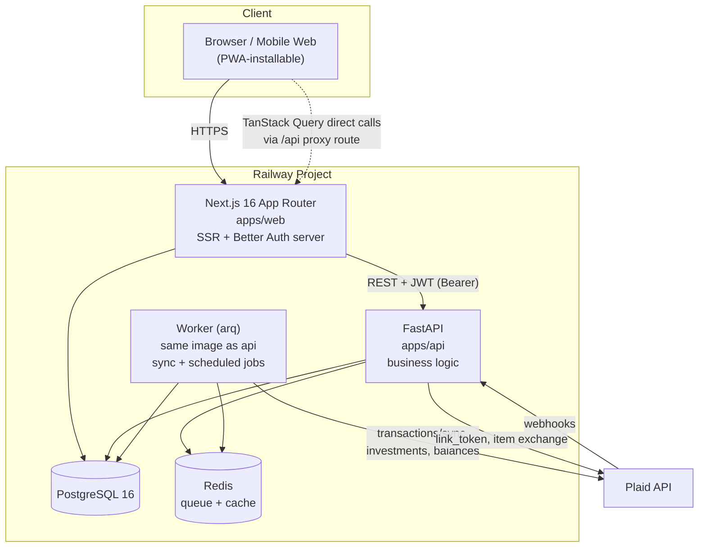
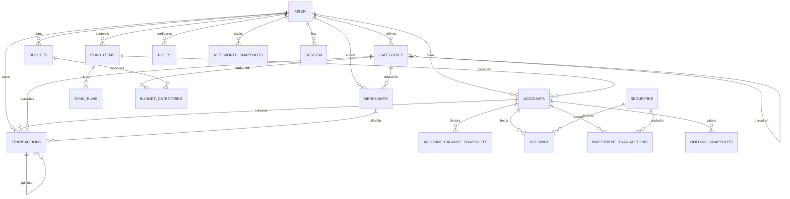
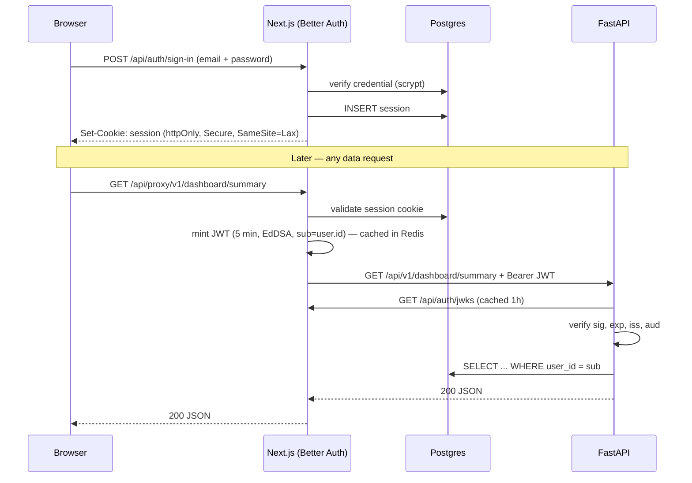
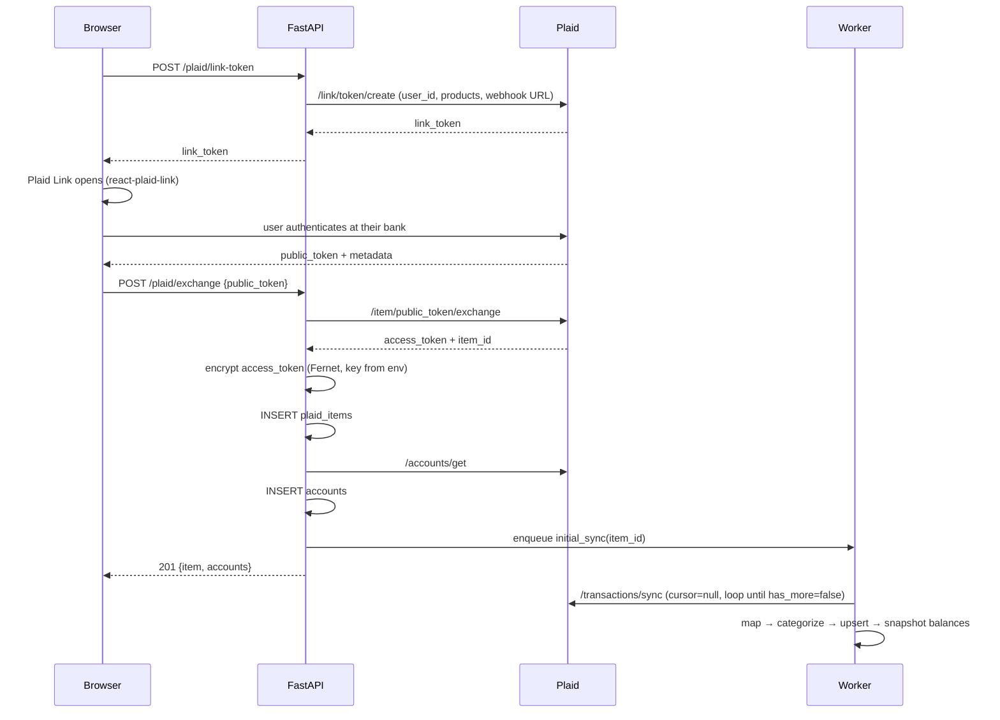
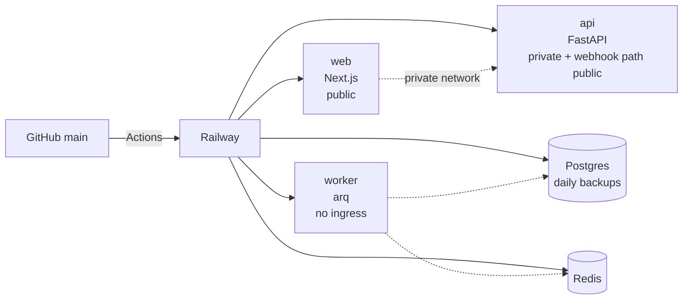

# Context

`finance-tracker` is an empty repository (one commit, a README stub). The goal is a **personal finance web application** for a single owner-operator: a mobile-first dashboard that aggregates bank accounts, credit cards, loans, and investments into one place via Plaid, with transactions, simple budgeting, investments, and cash-flow views.

This document is the implementation blueprint. **No application code is written in this phase.** The deliverable is a design detailed enough that another engineer could build the app from it.

Decisions locked with the user before writing:

| Decision | Choice |
|---|---|
| Auth | **Better Auth** — self-hosted, users in our own Postgres |
| Repo layout | **Single monorepo** (`apps/web`, `apps/api`, `infra/`) |
| Tenancy | **Multi-tenant schema, single-user in practice** — every row carries `user_id`, signup closed |
| Plaid | **Sandbox first**, Production access applied for in parallel; manual accounts as fallback |

Design inspiration throughout: **Origin Financial** — its layout, spacing, typography, navigation, and dashboard organization. Not a clone; no copied assets, copy, or brand marks.

**On approval**, the first action is to write this document to `PLAN.md` at the repository root (the user's requested deliverable), then begin Phase 0.

---

# 1. Overall Architecture

Three deployable units plus Plaid as the external data source.



## Why this shape

- **Next.js owns auth and rendering.** Better Auth runs in Next's route handlers, writes sessions to Postgres, and mints a short-lived JWT that the browser never has to manage. The web app is the only thing the browser talks to.
- **FastAPI owns money.** Every balance, category rollup, budget calculation, and Plaid call lives in Python. This keeps financial logic in one testable place and leaves the door open for the future AI/forecasting features, which are far better served by Python (pandas, numpy, scikit, Anthropic SDK).
- **The worker is the same image as the API**, different entrypoint. Zero code duplication, one Dockerfile, one dependency set.
- **Redis is queue + cache.** Small enough to be free-tier on Railway, and it gives us a place to put idempotency keys and rate-limit counters.

## Request path

The browser never calls FastAPI directly across origins. Next.js exposes `/api/proxy/[...path]` — a thin route handler that:

1. Reads the Better Auth session (httpOnly cookie).
2. Mints/fetches a cached short-lived JWT (5 min, signed with the shared JWKS key).
3. Forwards the request to `API_INTERNAL_URL` with `Authorization: Bearer <jwt>`.

This gives us: no CORS config, no tokens in `localStorage` (XSS-resistant), and the ability to move the API behind a private network on Railway.

**Trade-off:** one extra hop of latency (~5–15ms intra-region on Railway). Worth it for the security posture and the simplicity of never doing token refresh in the client.

---

# 2. Folder Structure

```
finance-tracker/
├── PLAN.md
├── README.md
├── docker-compose.yml              # postgres + redis + api + worker + web
├── Makefile                        # make dev / test / migrate / seed
├── .github/workflows/
│   ├── ci.yml                      # lint + typecheck + test, path-filtered
│   └── deploy.yml                  # Railway deploy on main
│
├── apps/
│   ├── web/
│   │   ├── src/
│   │   │   ├── app/
│   │   │   │   ├── (auth)/         # login, unauthenticated shell
│   │   │   │   │   └── login/page.tsx
│   │   │   │   ├── (app)/          # authenticated shell: nav + providers
│   │   │   │   │   ├── layout.tsx
│   │   │   │   │   ├── page.tsx            # Dashboard
│   │   │   │   │   ├── accounts/
│   │   │   │   │   │   ├── page.tsx
│   │   │   │   │   │   └── [id]/page.tsx
│   │   │   │   │   ├── transactions/page.tsx
│   │   │   │   │   ├── budgets/page.tsx
│   │   │   │   │   ├── investments/page.tsx
│   │   │   │   │   ├── cash-flow/page.tsx
│   │   │   │   │   └── settings/
│   │   │   │   │       ├── page.tsx
│   │   │   │   │       ├── connections/page.tsx
│   │   │   │   │       ├── categories/page.tsx
│   │   │   │   │       ├── rules/page.tsx
│   │   │   │   │       └── data/page.tsx    # import / export
│   │   │   │   ├── api/
│   │   │   │   │   ├── auth/[...all]/route.ts   # Better Auth handler
│   │   │   │   │   └── proxy/[...path]/route.ts # JWT-signing proxy to FastAPI
│   │   │   │   ├── layout.tsx
│   │   │   │   └── globals.css
│   │   │   ├── components/
│   │   │   │   ├── ui/             # shadcn primitives (generated, rarely edited)
│   │   │   │   ├── layout/         # AppShell, BottomTabs, Sidebar, TopBar
│   │   │   │   ├── charts/         # NetWorthChart, CategoryDonut, CashFlowBars
│   │   │   │   ├── dashboard/      # NetWorthHero, StatTile, RecentTransactions
│   │   │   │   ├── accounts/
│   │   │   │   ├── transactions/
│   │   │   │   ├── budgets/
│   │   │   │   ├── investments/
│   │   │   │   └── shared/         # EmptyState, ErrorState, Money, DateRangePicker
│   │   │   ├── lib/
│   │   │   │   ├── api/            # generated client + typed fetch wrapper
│   │   │   │   ├── auth.ts         # Better Auth server config
│   │   │   │   ├── auth-client.ts  # Better Auth React client
│   │   │   │   ├── query.ts        # QueryClient factory, defaults
│   │   │   │   ├── format.ts       # currency / date / percent formatters
│   │   │   │   └── utils.ts        # cn()
│   │   │   ├── hooks/              # useAccounts, useTransactions, usePlaidLink…
│   │   │   ├── types/              # generated from OpenAPI
│   │   │   └── proxy.ts            # route protection (Next 16 renamed middleware)
│   │   ├── e2e/                    # Playwright
│   │   ├── tailwind.config.ts
│   │   ├── next.config.ts
│   │   └── package.json
│   │
│   └── api/
│       ├── app/
│       │   ├── main.py             # FastAPI app factory, middleware, routers
│       │   ├── config.py           # pydantic-settings
│       │   ├── deps.py             # get_db, get_current_user, pagination
│       │   ├── api/v1/
│       │   │   ├── router.py
│       │   │   └── routes/
│       │   │       ├── accounts.py
│       │   │       ├── transactions.py
│       │   │       ├── budgets.py
│       │   │       ├── categories.py
│       │   │       ├── rules.py
│       │   │       ├── investments.py
│       │   │       ├── dashboard.py
│       │   │       ├── cashflow.py
│       │   │       ├── plaid.py
│       │   │       ├── webhooks.py
│       │   │       └── data.py     # import / export
│       │   ├── models/             # SQLAlchemy 2.0 ORM, one file per aggregate
│       │   ├── schemas/            # Pydantic v2 request/response
│       │   ├── services/           # ALL business logic lives here
│       │   │   ├── account_service.py
│       │   │   ├── transaction_service.py
│       │   │   ├── categorization.py
│       │   │   ├── budget_service.py
│       │   │   ├── networth_service.py
│       │   │   ├── investment_service.py
│       │   │   ├── cashflow_service.py
│       │   │   └── plaid/
│       │   │       ├── client.py
│       │   │       ├── link.py
│       │   │       ├── sync.py         # transactions/sync cursor loop
│       │   │       ├── investments.py
│       │   │       └── mappers.py      # Plaid payload -> our models
│       │   ├── workers/
│       │   │   ├── main.py         # arq WorkerSettings + cron schedule
│       │   │   └── tasks/
│       │   ├── core/
│       │   │   ├── security.py     # JWT verify (JWKS), webhook verify
│       │   │   ├── crypto.py       # Fernet envelope encryption for tokens
│       │   │   ├── errors.py       # exception types + handlers
│       │   │   ├── logging.py      # structlog config
│       │   │   └── money.py        # Decimal helpers, minor-unit conversion
│       │   └── db/
│       │       ├── session.py
│       │       └── base.py
│       ├── alembic/versions/
│       ├── tests/
│       │   ├── unit/
│       │   ├── integration/
│       │   └── fixtures/plaid/     # recorded Plaid sandbox payloads
│       ├── pyproject.toml          # uv-managed
│       └── Dockerfile
│
├── packages/
│   └── shared/                     # OpenAPI spec snapshot + generated TS types
│
└── infra/
    ├── railway.json
    └── scripts/
```

**Convention that matters most:** routes are thin (parse → call service → serialize). All logic is in `services/`. This is what makes the future AI features additive rather than a refactor — an `insights_service.py` reads from the same services the routes do.

---

# 3. Frontend Architecture

## Rendering strategy

| Page | Strategy | Why |
|---|---|---|
| Dashboard | RSC shell + streamed client widgets | Instant layout paint; each card resolves independently |
| Accounts list | RSC with prefetched query hydration | Data is small and stable |
| Account detail | RSC shell, client chart + infinite transaction list | Chart and list are interactive |
| Transactions | Client component (heavy filter/search state in URL) | Filters must be shareable and back-button correct |
| Budgets | RSC + client progress cards | Mostly read, light interaction |
| Investments | RSC shell + client charts | |
| Settings | Client (forms) | |

**Pattern:** the server component prefetches into a `QueryClient`, dehydrates, and wraps children in `<HydrationBoundary>`. Client components then call `useQuery` with the same key and render instantly with no waterfall — and still refetch in the background on focus.

## Component layering

1. **`components/ui/`** — shadcn primitives. Generated, theme-customized once, then treated as vendor code.
2. **Composites** — `StatTile`, `AccountRow`, `TransactionRow`, `BudgetProgressCard`, `ChartCard`. Presentational, take fully-formed props, zero data fetching. These are the ones we storybook and screenshot-test.
3. **Containers** — `NetWorthSection`, `TransactionList`. Own a `useQuery`, handle loading/empty/error, render composites.
4. **Pages** — layout and composition only.

**Rule:** a component either fetches data or takes props — never both. This keeps composites trivially testable and reusable across pages.

## Type safety across the stack

FastAPI emits OpenAPI at `/openapi.json`. CI runs `openapi-typescript` to generate `packages/shared/api-types.ts`, and a typed `apiFetch<T>` wrapper consumes it. A backend response-shape change that the frontend doesn't handle **fails CI typecheck**. This is the single highest-leverage piece of infrastructure in the project — set it up in Phase 1, not later.

## Key frontend decisions

- **URL as filter state.** Transaction filters (`?q=&from=&to=&accounts=&categories=&min=&max=`) live in the URL via `nuqs`. Shareable, back-button correct, and it doubles as the query key.
- **Cursor pagination + `useInfiniteQuery`** for transactions. Offset pagination breaks when a sync inserts rows mid-scroll.
- **Optimistic updates** for the three interactions that must feel instant: recategorize, edit note, toggle "exclude from budget". Everything else waits for the server.
- **Money never touches `number`.** Amounts cross the wire as integer minor units (cents) plus an ISO currency code; a `Money` component formats via `Intl.NumberFormat`. This eliminates float drift and makes multi-currency a later config change rather than a migration.

---

# 4. Backend Architecture

Layered, with strict dependency direction: `routes → services → models`. Services may call other services; models never import services.

```
HTTP request
  → middleware (request-id, structlog binding, timing)
  → dependency: verify JWT → load User → attach to request
  → route handler: validate via Pydantic
  → service: business logic, owns the transaction boundary
  → repository/ORM: SQLAlchemy 2.0 async
  → response: Pydantic model (never an ORM object)
```

## Core services

| Service | Responsibility |
|---|---|
| `account_service` | CRUD, manual accounts, balance snapshots, archive/unlink |
| `transaction_service` | Query/filter/search, manual create/edit, **splits**, **transfer pairing** |
| `categorization` | Plaid PFC → our taxonomy; user rule engine; merchant memory |
| `budget_service` | Monthly budget CRUD, spend-vs-budget rollups |
| `networth_service` | Daily net-worth snapshots, historical series |
| `investment_service` | Holdings, allocation, portfolio value, performance |
| `cashflow_service` | Monthly income/expense aggregation, trends, top categories |
| `plaid/*` | Link token, public-token exchange, sync cursor loop, mappers |

## Three pieces of logic worth calling out now

**Transaction splits.** A split is not a mutation of the parent — it's child rows. The parent gets `is_split = true` and is excluded from all aggregations; children carry `parent_transaction_id` and their amounts must sum to the parent's. Enforced in the service and by a check on write. This is the design that avoids the classic "my totals are double-counted" bug.

**Transfers.** Money moving between my own accounts is not income and not spending. Detection: opposite-signed amounts within ±$0.01, in different accounts of the same user, within a 4-day window. Candidates get auto-linked via `transfer_group_id` and marked `is_transfer`; all cash-flow and budget aggregations exclude them. The user can confirm or unlink in the UI. **Getting this wrong makes every other number wrong**, so it ships in Phase 3, not as a nicety.

**Categorization order of precedence** (first match wins):
1. Manual user override on the transaction (`category_source = 'user'`) — never overwritten by a sync.
2. Active user rule, by priority.
3. Merchant memory (this merchant was categorized X ≥2 times before).
4. Plaid personal finance category → our taxonomy map.
5. `Uncategorized`.

Preserving rule 1 across syncs is the requirement that shapes the whole upsert path.

## Aggregation strategy

Dashboard numbers are computed **on read** from indexed queries, with a Redis cache (5 min TTL) keyed by `user_id + month`. Two exceptions get materialized because they're expensive over long ranges:

- `account_balance_snapshots` — one row per account per day, written by the nightly job.
- `net_worth_snapshots` — one row per user per day.

Charts read snapshots directly. At personal scale (~1–5k txns/yr) this is comfortably fast; if it ever isn't, the fix is a monthly rollup table, not a rewrite.

---

# 5. Database Schema

PostgreSQL 16. Conventions: `uuid` v7 PKs (time-sortable), `timestamptz` everywhere, `snake_case`, `created_at`/`updated_at` on all tables, soft delete (`deleted_at`) on user-facing data.

**Money:** stored as `BIGINT` minor units + `currency CHAR(3)`. Never `FLOAT`. `NUMERIC` was considered but integer cents is simpler to reason about and serializes cleanly to JSON.

**Sign convention:** for depository/investment accounts, **negative = money out**, positive = money in. For credit/loan accounts, a purchase is negative and a payment is positive. `balance_current` on a liability is stored positive (amount owed) and negated when rolling into net worth. This is written down here because inconsistency on this point is the #1 source of finance-app bugs.

### Auth (managed by Better Auth, same database)

| Table | Notes |
|---|---|
| `user` | `id`, `email`, `email_verified`, `name`, `image`, timestamps |
| `session` | `id`, `user_id`, `token`, `expires_at`, `ip_address`, `user_agent` |
| `account` | OAuth/credential records — **renamed `auth_account`** to avoid colliding with our financial `accounts` table |
| `verification` | tokens |

### Application tables

**`plaid_items`** — one per connected institution.
`id, user_id→user, plaid_item_id (uniq), plaid_institution_id, institution_name, institution_logo_url, access_token_encrypted, transactions_cursor, status (good|login_required|pending_expiration|error), last_successful_sync_at, last_error_code, last_error_message, consent_expires_at, created_at, updated_at`

**`accounts`** — financial accounts, Plaid-linked or manual.
`id, user_id, plaid_item_id (nullable → manual), plaid_account_id (uniq nullable), name, official_name, type (depository|credit|loan|investment|other), subtype, mask, currency, balance_current, balance_available, balance_limit, is_manual, is_hidden, include_in_net_worth, display_order, last_synced_at, deleted_at, timestamps`
Indexes: `(user_id, type)`, `(user_id, deleted_at)`

**`account_balance_snapshots`**
`id, account_id, date, balance_current, balance_available` — unique `(account_id, date)`

**`net_worth_snapshots`**
`id, user_id, date, assets, liabilities, net_worth, cash, investments, credit` — unique `(user_id, date)`

**`categories`** — system defaults seeded per user + user-created; one level of nesting.
`id, user_id, parent_id (self-FK), name, slug, icon, color, kind (income|expense|transfer), is_system, is_archived, display_order` — unique `(user_id, slug)`

**`merchants`**
`id, user_id, name, normalized_name, logo_url, default_category_id` — unique `(user_id, normalized_name)`

**`transactions`** — the hot table.
```
id, user_id, account_id, plaid_transaction_id (uniq nullable),
amount, currency, date, authorized_date, datetime,
name, merchant_name, merchant_id, description,
category_id, category_source (plaid|rule|merchant|user),
plaid_pfc_primary, plaid_pfc_detailed,
pending, pending_plaid_transaction_id,
notes, is_manual, is_hidden, exclude_from_budget,
is_split, parent_transaction_id (self-FK),
is_transfer, transfer_group_id,
location_city, location_region, payment_channel,
deleted_at, timestamps
```
Indexes:
- `(user_id, date DESC)` — the default list
- `(account_id, date DESC)` — account detail
- `(user_id, category_id, date)` — budget & category rollups
- `(user_id, transfer_group_id) WHERE transfer_group_id IS NOT NULL`
- GIN on `to_tsvector('english', name || ' ' || coalesce(merchant_name,'') || ' ' || coalesce(notes,''))` — full-text search
- partial `(user_id, date DESC) WHERE deleted_at IS NULL AND is_split = false` — the aggregation path

**`budgets`** — one per user per month.
`id, user_id, month (DATE, first of month), total_income_expected, note` — unique `(user_id, month)`

**`budget_categories`**
`id, budget_id, category_id, amount, rollover (bool, default false)` — unique `(budget_id, category_id)`

**`rules`** — user categorization rules.
`id, user_id, name, priority, is_active, conditions (JSONB), actions (JSONB), applies_to_existing, last_applied_at`
`conditions`: `{ "all": [ {"field":"merchant_name","op":"contains","value":"Whole Foods"}, {"field":"amount","op":"gt","value":5000} ] }`
`actions`: `{ "set_category_id": "...", "set_notes": "...", "exclude_from_budget": true }`
JSONB rather than columns because the rule shape will grow, and this avoids a migration each time.

**`holdings`**
`id, user_id, account_id, security_id, quantity (NUMERIC(20,8)), cost_basis, institution_price, institution_value, currency, as_of_date, timestamps` — unique `(account_id, security_id)`

**`securities`**
`id, plaid_security_id (uniq), ticker, name, type, cusip, isin, close_price, close_price_as_of, currency, is_cash_equivalent`

**`investment_transactions`**
`id, user_id, account_id, security_id, plaid_investment_transaction_id (uniq), date, name, type, subtype, quantity, price, fees, amount, currency`

**`holding_snapshots`** — daily portfolio value for performance charts.
`id, user_id, account_id, date, total_value, total_cost_basis` — unique `(account_id, date)`

**`sync_runs`** — observability for every sync.
`id, user_id, plaid_item_id, kind (transactions|investments|balances), status (running|success|error), added, modified, removed, started_at, finished_at, error_code, error_message`

**`audit_log`** — append-only.
`id, user_id, action, entity_type, entity_id, before (JSONB), after (JSONB), ip, created_at`

### Reserved for future features (create nothing now, but the shape is settled)

`goals`, `insights`, `notifications`, `recurring_series` (subscription detection), `forecasts`. All follow the same `user_id`-scoped pattern and read from existing services — none require altering the tables above. **This is the specific claim that "no major refactoring" rests on:** every future feature is a new table plus a new service, never a change to `transactions` or `accounts`.

---

# 6. Entity Relationship Diagram



---

# 7. API Design

REST, versioned at `/api/v1`. JSON only. Cursor pagination on collections. Every endpoint is implicitly scoped to the authenticated user — **`user_id` is never a query parameter**, it comes from the token. This is enforced by a shared dependency, not by discipline in each handler.

## Conventions

- **Envelope for collections:** `{ "data": [...], "next_cursor": "...", "has_more": bool }`. Single resources are bare objects.
- **Errors:** RFC 9457 Problem Details — `{ "type", "title", "status", "detail", "instance", "code", "errors": [...] }`.
- **Idempotency:** `Idempotency-Key` header honored on all mutating Plaid endpoints.
- **Money in payloads:** `{ "amount": -4599, "currency": "USD" }` (integer cents).

## Endpoints

### Dashboard
| Method | Path | Notes |
|---|---|---|
| GET | `/dashboard/summary?month=YYYY-MM` | Net worth, assets, liabilities, cash, investments, credit, monthly spend/income — one call, one round trip |
| GET | `/dashboard/net-worth?range=1m\|3m\|6m\|1y\|all` | Time series from snapshots |
| GET | `/dashboard/spending-by-category?month=` | For the donut |
| GET | `/dashboard/cash-flow?months=6` | Income vs expense bars |

The dashboard deliberately gets purpose-built endpoints rather than composing five generic ones client-side. Mobile first means minimizing round trips.

### Accounts
```
GET    /accounts                      ?type=&include_hidden=
POST   /accounts                      manual account
GET    /accounts/{id}
PATCH  /accounts/{id}                 name, hidden, include_in_net_worth, display_order
DELETE /accounts/{id}                 soft delete
GET    /accounts/{id}/balances        ?range=  historical
GET    /accounts/{id}/transactions    cursor paginated
POST   /accounts/{id}/refresh         force sync (rate limited)
```

### Transactions
```
GET    /transactions                  ?q=&from=&to=&account_ids=&category_ids=&
                                       min_amount=&max_amount=&type=&pending=&
                                       uncategorized=&cursor=&limit=
POST   /transactions                  manual
GET    /transactions/{id}
PATCH  /transactions/{id}             category, notes, merchant, exclude_from_budget, hidden
DELETE /transactions/{id}
POST   /transactions/{id}/split       body: [{amount, category_id, notes}] — replaces existing splits
DELETE /transactions/{id}/split       unsplit
POST   /transactions/link-transfer    body: {transaction_ids: [a, b]}
DELETE /transactions/{id}/transfer    unlink
POST   /transactions/bulk-categorize  body: {transaction_ids, category_id, create_rule?: bool}
```

`create_rule: true` on bulk-categorize is the highest-value UX affordance in the whole app — "categorize these 40 Starbucks charges and remember it."

### Budgets, Categories, Rules
```
GET    /budgets/{month}               budget + per-category spent/remaining/pct, computed server-side
PUT    /budgets/{month}               upsert whole month
PATCH  /budgets/{month}/categories/{category_id}
POST   /budgets/{month}/copy-from     ?source=YYYY-MM

GET    /categories                    tree
POST   /categories
PATCH  /categories/{id}
DELETE /categories/{id}               ?reassign_to=<id>  (required if in use)

GET    /rules
POST   /rules                         ?apply_to_existing=true → enqueues job
PATCH  /rules/{id}
DELETE /rules/{id}
POST   /rules/{id}/preview            returns matching transactions without applying
```

`POST /rules/{id}/preview` exists because a rule that silently recategorizes 300 transactions is terrifying. Show the blast radius first.

### Investments & Cash Flow
```
GET /investments/summary              total value, day change, total gain/loss, cost basis
GET /investments/holdings             ?account_id=
GET /investments/allocation           ?group_by=asset_class|account|security|sector
GET /investments/performance          ?range=
GET /investments/transactions         cursor paginated

GET /cash-flow/summary                ?months=12
GET /cash-flow/by-category            ?from=&to=&kind=income|expense
GET /cash-flow/trends                 ?months=12
```

### Plaid & Data
```
POST /plaid/link-token                {mode: "connect"|"update", item_id?}
POST /plaid/exchange                  {public_token, institution}  → creates item + accounts, enqueues initial sync
GET  /plaid/items
DELETE /plaid/items/{id}              calls /item/remove, then soft-deletes locally
POST /plaid/items/{id}/sync           manual refresh
POST /webhooks/plaid                  unauthenticated, signature-verified

GET  /data/export?format=csv|json&entity=transactions|accounts|all
POST /data/import                     multipart CSV + column mapping
GET  /me / PATCH /me                  preferences: currency, week start, theme, timezone
```

---

# 8. Authentication Flow

**Better Auth**, chosen because: it's TypeScript-native and integrates into Next's App Router in a single route handler; sessions live in **our** Postgres so `user.id` is a real FK target for every financial table (no `external_id` indirection); it's free and self-hosted, which matters for an app holding financial data; and its plugin system gives us JWT/JWKS out of the box for the FastAPI hand-off, plus passkeys and TOTP 2FA when we want them.

Trade-off vs Clerk: we own password reset, email delivery, and MFA setup. For a single-user app that's a few hours of work, and it avoids putting an identity vendor between me and my own money data.

## Sign-in



## Decisions

- **Session cookie, not a token in JS.** httpOnly + Secure + SameSite=Lax. Immune to XSS token theft.
- **Asymmetric JWT (EdDSA/Ed25519) via JWKS.** FastAPI holds no shared secret — it only fetches public keys. Key rotation needs no API redeploy.
- **5-minute JWT lifetime.** Short enough that revocation lag is irrelevant; the proxy re-mints transparently.
- **Signup disabled** (`emailAndPassword.disableSignUp: true`) after the owner account is seeded. Single-user in practice, multi-tenant in schema.
- **2FA (TOTP) in Phase 8**, before Plaid Production goes live. Non-negotiable for an app with real bank data.
- **`proxy.ts`** redirects unauthenticated requests off `(app)` routes — a UX nicety only. (Next.js 16 renamed Middleware to Proxy; the file lives at `src/proxy.ts` and exports a `proxy` function.) The real gate is FastAPI verifying the JWT on every single request. Never trust it as the security boundary.

---

# 9. Plaid Integration Flow

Sandbox first. Apply for Production access in **Phase 4**, in parallel with development, because approval takes days-to-weeks and is the single biggest schedule risk in this project.

## Connect



## Ongoing sync — `/transactions/sync`, not `/transactions/get`

`/transactions/sync` gives a cursor and explicit `added`/`modified`/`removed` sets. It handles the pending→posted transition correctly, which `/transactions/get` does not. Using `/get` here would be a slow-motion correctness disaster.

The loop, per item:
1. `POST /transactions/sync` with the stored cursor.
2. Apply `added` (upsert by `plaid_transaction_id`), `modified` (**preserving user overrides** — never clobber `category_source='user'`, `notes`, `is_split`, `exclude_from_budget`), `removed` (soft delete).
3. Repeat while `has_more`.
4. Persist the new cursor **in the same transaction as the data**. If the cursor commits and the data doesn't, those transactions are lost forever.
5. Run categorization → rules → merchant memory on new rows.
6. Run transfer detection over the affected window.
7. Write balance snapshots; recompute the net-worth snapshot.
8. Write a `sync_runs` row.

## Webhooks

`POST /webhooks/plaid`, unauthenticated but **signature-verified** via `Plaid-Verification` JWT against `/webhook_verification_key/get` (with a key cache). Respond `200` immediately, enqueue the work — Plaid retries on non-2xx, and slow handlers cause duplicate deliveries.

| Webhook | Action |
|---|---|
| `SYNC_UPDATES_AVAILABLE` | Enqueue transaction sync |
| `DEFAULT_UPDATE` / `INITIAL_UPDATE` | Enqueue sync (legacy) |
| `TRANSACTIONS_REMOVED` | Soft-delete listed ids |
| `ITEM_ERROR` / `PENDING_EXPIRATION` | Mark item `login_required`, surface a re-auth banner |
| `NEW_ACCOUNTS_AVAILABLE` | Prompt Link in update mode |
| `HOLDINGS`/`INVESTMENTS_TRANSACTIONS` update | Enqueue investment sync |

## Error handling

| Plaid error | Response |
|---|---|
| `ITEM_LOGIN_REQUIRED` | Item → `login_required`; UI shows "Reconnect" → Link update mode |
| `RATE_LIMIT_EXCEEDED` | Exponential backoff, jitter, retry up to 5× |
| `PRODUCT_NOT_READY` | Retry in 60s (normal right after connect) |
| `INSTITUTION_DOWN` | Retry next cycle, show a soft badge, don't alarm the user |
| `INVALID_ACCESS_TOKEN` | Item → `error`, require full reconnect |

**Access tokens** are encrypted at rest with Fernet using a key from `PLAID_ENCRYPTION_KEY` (Railway secret, never in the repo). They are decrypted only inside `plaid/client.py`, never logged, never returned by any endpoint, and never leave the API service.

---

# 10. Background Jobs & Scheduled Syncing

**arq** (Redis-backed, async-native, ~500 LOC of surface area). Celery is the reflexive choice but brings a broker/beat/flower stack that's overkill here; arq runs cron and queues in one small worker process.

| Job | Schedule | Purpose |
|---|---|---|
| `sync_transactions(item_id)` | On webhook + hourly safety net | Cursor loop |
| `sync_balances()` | Every 6h | Refresh balances between transaction syncs |
| `sync_investments(item_id)` | Daily 06:00 ET | Holdings + investment transactions |
| `snapshot_balances()` | Daily 02:00 ET | Write `account_balance_snapshots` |
| `snapshot_net_worth()` | Daily 02:15 ET | Write `net_worth_snapshots` |
| `snapshot_holdings()` | Daily 02:30 ET (weekdays) | Portfolio performance series |
| `apply_rule(rule_id)` | On demand | Backfill a new rule |
| `detect_transfers(user_id, window)` | After each sync | Pair internal transfers |
| `refresh_item_health()` | Daily | Flag items needing re-auth |
| `cleanup_old_sync_runs()` | Weekly | Retain 90 days |

## Job discipline

- **Idempotent by construction.** Every job can run twice with no side effects — snapshots use `ON CONFLICT (account_id, date) DO UPDATE`, transactions upsert on `plaid_transaction_id`.
- **Locks.** `SELECT ... FOR UPDATE SKIP LOCKED` on `plaid_items` prevents a webhook-triggered sync and the hourly cron from racing on the same item.
- **Retries.** 3 attempts, exponential backoff with jitter; terminal failure writes a `sync_runs` error row and surfaces in Settings → Connections.
- **Backfill on connect.** Initial sync requests 24 months so the net-worth chart isn't empty on day one. Historical daily net-worth before the connect date is backfilled by walking transactions backward from current balances — approximate, clearly labeled as such in the UI.

Future AI features (forecasting, subscription detection, weekly summaries) slot in as additional cron jobs writing to `insights` — no changes to the sync path.

---

# 11. Security Considerations

This app holds bank credentials-by-proxy and complete financial history. Treated accordingly.

| Area | Measure |
|---|---|
| Transport | HTTPS only, HSTS w/ preload, TLS 1.2+ |
| Session | httpOnly + Secure + SameSite=Lax cookies; 7-day expiry w/ rolling refresh |
| API auth | Short-lived EdDSA JWT, JWKS verification, `iss`/`aud`/`exp` all checked |
| Tenant isolation | Every query filtered by `user_id` via a shared dependency; **integration test asserts cross-user 404 on every resource route** |
| Plaid tokens | Fernet-encrypted at rest, decrypted only in the Plaid client, never logged or serialized |
| Secrets | Railway env vars; `.env` gitignored; `gitleaks` in CI |
| Input | Pydantic v2 strict on every payload; SQLAlchemy params only, zero string-built SQL |
| Rate limiting | `slowapi` — 5/min on auth, 10/min on Plaid link, 100/min general |
| Webhooks | Plaid JWT signature verification + 5-min replay window |
| Headers | CSP (nonce-based), X-Frame-Options DENY, X-Content-Type-Options nosniff, Referrer-Policy |
| CSRF | Better Auth built-in tokens; SameSite as defense in depth |
| PII in logs | Structured logger redacts `access_token`, `public_token`, account numbers, emails |
| Dependencies | Dependabot + `pip-audit` + `npm audit` in CI |
| Audit | `audit_log` on every financial mutation |
| Backups | Railway daily Postgres backups + weekly `pg_dump` to object storage, restore tested once per quarter |
| 2FA | TOTP enabled before Plaid Production cutover |

**Explicitly out of scope:** we never store bank usernames or passwords — that's the entire point of Plaid Link. The app never sees them.

**Compliance note:** this is a personal, single-user application, so PCI/SOC2 obligations don't attach. If it were ever opened to other users, that changes materially and would need revisiting before anything else.

---

# 12. Deployment Architecture

Railway project, four services from one repo.



| Service | Build | Start | Health |
|---|---|---|---|
| web | Dockerfile (Next standalone output) | `node server.js` | `/api/health` |
| api | Dockerfile (uv, python:3.12-slim) | `uvicorn app.main:app` | `/health` (liveness), `/health/ready` (DB+Redis) |
| worker | same image as api | `arq app.workers.main.WorkerSettings` | heartbeat key in Redis |

- **Environments:** `production` (from `main`) and `staging` (from `develop`), each with its own Postgres and Plaid Sandbox keys. Staging exists so Plaid webhook changes get exercised before touching real data.
- **Migrations** run as a Railway pre-deploy command (`alembic upgrade head`) — not in the app entrypoint, which would race across replicas.
- **Rollback:** Railway keeps prior deployments; migrations are written forward-compatible (add column → backfill → switch reads → drop in a later release) so a code rollback never strands the schema.
- **Domain:** `finance.<yourdomain>` on web; the API is private-network only except `/webhooks/plaid`, which needs a public route for Plaid to reach.
- **Cost estimate:** ~$15–25/mo on Railway Hobby for all four services plus Postgres and Redis at personal scale.

---

# 13. Recommended Third-Party Libraries

## Frontend

| Library | Purpose | Why this one |
|---|---|---|
| `next` 15 | Framework | App Router, RSC, streaming |
| `tailwindcss` 4 | Styling | |
| `shadcn/ui` | Components | Copy-in, fully ownable — no fighting a vendor's theme |
| `@tanstack/react-query` 5 | Server state | Cache, background refetch, optimistic updates |
| `recharts` | Charts | Declarative, composable, good enough responsiveness |
| `framer-motion` | Animation | Layout animations, shared element transitions, `AnimatePresence` |
| `react-plaid-link` | Plaid Link | Official |
| `nuqs` | URL state | Type-safe search params for filters |
| `react-hook-form` + `zod` | Forms | |
| `date-fns` | Dates | Tree-shakeable, immutable |
| `@tanstack/react-table` | Data grid | Transactions table on desktop |
| `sonner` | Toasts | Ships with shadcn, excellent defaults |
| `vaul` | Drawers | iOS-quality bottom sheets — critical for mobile-first feel |
| `lucide-react` | Icons | |
| `next-themes` | Dark mode | |
| `@number-flow/react` | Animated numerals | Odometer-style transitions on the net-worth hero — small touch, big premium impression |

Explicitly **not** using a charting library heavier than Recharts (Nivo/visx) — Recharts covers all six chart types needed and keeps the bundle small.

## Backend

| Library | Purpose |
|---|---|
| `fastapi` + `uvicorn[standard]` | API |
| `sqlalchemy` 2.0 (async) + `asyncpg` | ORM |
| `alembic` | Migrations |
| `pydantic` v2 + `pydantic-settings` | Validation & config |
| `plaid-python` | Plaid SDK |
| `arq` | Jobs & cron |
| `cryptography` | Fernet token encryption |
| `pyjwt[crypto]` | JWT/JWKS verification |
| `structlog` | Structured logging |
| `sentry-sdk` | Errors |
| `slowapi` | Rate limiting |
| `uv` | Dependency management — 10–100× faster than pip in CI |
| `pytest`, `pytest-asyncio`, `httpx`, `factory-boy`, `respx` | Testing |
| `ruff`, `mypy` | Lint & types |

---

# 14. State Management Strategy

Four distinct kinds of state, four distinct tools. No Redux, no global store.

| Kind | Tool | Examples |
|---|---|---|
| **Server state** | TanStack Query | Accounts, transactions, budgets, everything from the API |
| **URL state** | `nuqs` | Filters, date range, active tab, selected account |
| **Form state** | React Hook Form | Every form |
| **Local UI state** | `useState` / `useReducer` | Sheet open, dropdown, hover |
| **Global client state** | React Context (rare) | Theme, currency preference, sidebar collapsed |

**Query key factory** — one file, no stringly-typed keys:
```
qk.accounts.all()                 → ['accounts']
qk.accounts.detail(id)            → ['accounts', id]
qk.transactions.list(filters)     → ['transactions', 'list', filters]
qk.dashboard.summary(month)       → ['dashboard', 'summary', month]
```

**Invalidation map** — the thing that keeps numbers consistent:

| Mutation | Invalidates |
|---|---|
| Categorize transaction | `transactions`, `budgets`, `dashboard.spendingByCategory`, `cashFlow` |
| Split transaction | `transactions`, `budgets`, `dashboard`, `cashFlow` |
| Link transfer | `transactions`, `cashFlow`, `budgets` |
| Plaid item connected | everything (`queryClient.invalidateQueries()`) |
| Manual account balance edit | `accounts`, `dashboard`, `netWorth` |

**Stale times**, tuned to how fast each thing actually changes:

| Data | staleTime | Rationale |
|---|---|---|
| Accounts / balances | 60s | Change only on sync |
| Transactions | 30s | |
| Dashboard summary | 60s | Expensive to compute |
| Net-worth series | 5m | Daily granularity — no point refetching |
| Categories / rules | 10m | Near-static |
| Investments | 5m | |

---

# 15. Caching Strategy

Five layers, each doing one job.

| Layer | What | TTL | Invalidation |
|---|---|---|---|
| Browser HTTP | Static assets, fonts | 1y immutable | Content hash |
| TanStack Query | All API responses | See §14 | Mutation-driven |
| Next.js RSC | Static shells | build | Redeploy |
| Redis (API) | Dashboard summary, net-worth series, category rollups, JWKS | 5m / 15m / 1h | Key delete on write |
| Postgres | Daily snapshots as materialized history | permanent | Nightly job |

**Redis key scheme:** `ft:{user_id}:dashboard:{month}`, `ft:{user_id}:networth:{range}`, `ft:{user_id}:spend-by-cat:{month}`.

**Invalidation rule:** any write touching `transactions` or `accounts` deletes `ft:{user_id}:*` for the affected month(s). Blunt, but at single-user scale correctness beats cleverness — and a stale net-worth number destroys trust in the entire app.

**Deliberate non-goal:** no cache warming, no stale-while-revalidate at the Redis layer in v1. Add only if a measured page is slow.

---

# 16. Error Handling Strategy

## Backend

A small exception hierarchy, mapped once to HTTP by a global handler — routes never build error responses by hand.

```
AppError
├── NotFoundError            → 404
├── ValidationError          → 422
├── PermissionError          → 403
├── ConflictError            → 409
├── RateLimitError           → 429
├── ExternalServiceError     → 502
│   └── PlaidError           → 502 (+ plaid_error_code passthrough)
└── SyncError                → logged, never surfaced to a user request
```

Every response is RFC 9457 Problem Details with a stable machine-readable `code` (`PLAID_ITEM_LOGIN_REQUIRED`, `SPLIT_AMOUNT_MISMATCH`, …) and a `request_id` for correlation. **The client switches on `code`, never on `detail` text.**

## Frontend

Three tiers:
1. **Route error boundaries** (`error.tsx` per segment) — a failing chart never blanks the dashboard.
2. **Query-level** — every container renders explicit `isLoading` / `isError` / empty states. `ErrorState` composite with a retry button.
3. **Mutation-level** — toast on failure, automatic optimistic rollback.

Retry policy: 3 attempts with exponential backoff on 5xx and network errors; **never** on 4xx.

Special-cased user-facing errors, because generic messages are useless here:
- `PLAID_ITEM_LOGIN_REQUIRED` → inline "Reconnect <Institution>" banner that opens Link in update mode.
- `INSTITUTION_DOWN` → soft badge on the account: "Bank temporarily unavailable, last updated 4h ago."
- Offline → global banner, queries pause and resume on reconnect.

---

# 17. Logging & Monitoring

**Logging:** `structlog` → JSON to stdout → Railway log aggregation. Every log line carries `request_id`, `user_id`, `route`, `duration_ms`. A redaction processor strips `access_token`, `public_token`, `password`, `authorization`, and account numbers **before** serialization — not as a filter afterward.

Levels: `DEBUG` local, `INFO` production. Sync jobs log start/finish with counts at `INFO`; per-transaction detail at `DEBUG`.

**Frontend:** Sentry with session replay on errors only (never on healthy sessions — this is financial data on screen).

**Monitoring:**

| Signal | Tool | Alert |
|---|---|---|
| Uptime | Railway healthchecks + UptimeRobot | Down > 2 min |
| Errors | Sentry (both apps) | Any new issue |
| Failed syncs | `sync_runs` + daily digest email | Any item failing 2 days running |
| Item health | Daily job | Any item in `login_required` |
| Job queue depth | arq health key | Depth > 50 |
| DB | Railway metrics | Connections > 80%, disk > 80% |
| Web vitals | Vercel Analytics or Sentry | LCP > 2.5s |

**Deliberately skipping OpenTelemetry/Prometheus/Grafana in v1.** For a single-user app, Sentry plus structured logs plus a `sync_runs` table answers every question that actually gets asked. Adding a full observability stack here is cost without benefit.

---

# 18. Testing Strategy

Pragmatic pyramid — heavy where money is calculated, light where pixels are arranged.

## Backend

| Level | Tool | Coverage target | Focus |
|---|---|---|---|
| Unit | pytest | 85%+ on `services/` | Categorization precedence, split math, transfer detection, net-worth arithmetic, sign conventions |
| Integration | pytest + httpx + testcontainers Postgres | All routes | Real DB, real migrations, auth enforced |
| Plaid | `respx` + recorded sandbox fixtures | All sync paths | Never hits the network in CI |

**Non-negotiable test cases** — these encode the bugs that would otherwise ship:
- A user category override survives a Plaid `modified` sync.
- Split children sum to parent; parent excluded from all aggregations.
- A detected transfer contributes to neither income nor spending.
- Liability balances subtract from net worth, with correct sign.
- Every resource route returns 404 for another user's row.
- Sync is idempotent — running it twice produces identical DB state.
- Cursor is persisted in the same transaction as the data it describes.

## Frontend

| Level | Tool | Focus |
|---|---|---|
| Unit | Vitest | Formatters, chart data transforms, filter serialization |
| Component | Testing Library + MSW | Loading/empty/error states, optimistic updates |
| E2E | Playwright | Login → connect sandbox bank → see dashboard → categorize → set budget |
| Visual | Playwright screenshots at 375/768/1280 | Catch layout regressions on the design-heavy surfaces |
| A11y | `axe-core` in E2E | WCAG AA |

MSW handlers are generated from the same OpenAPI spec as the client types, so mocks can't drift from reality.

---

# 19. CI/CD Pipeline

```mermaid
graph LR
    PR[Pull Request] --> L[Lint + Typecheck]
    L --> T[Unit + Integration]
    T --> B[Build both images]
    B --> E[E2E on ephemeral stack]
    E --> M[Merge to main]
    M --> S[Deploy staging]
    S --> SM[Smoke tests]
    SM --> P[Deploy production]
    P --> PM[Post-deploy healthcheck]
```



**`ci.yml`** — path-filtered so a web-only PR doesn't run the Python suite.

| Job | Steps |
|---|---|
| `web` | pnpm install (cached) → `eslint` → `tsc --noEmit` → `vitest` → `next build` |
| `api` | `uv sync` (cached) → `ruff check` + `ruff format --check` → `mypy` → `pytest` w/ Postgres+Redis services |
| `contract` | Generate OpenAPI → regenerate TS types → **fail if `git diff` is non-empty** |
| `e2e` | docker-compose up full stack → seed Plaid sandbox → Playwright |
| `security` | `gitleaks` → `pip-audit` → `npm audit --audit-level=high` |

The `contract` job is what makes the two-language stack safe. Without it, backend and frontend drift silently and you find out in production.

**`deploy.yml`** — on `main`: build/push images → `alembic upgrade head` as pre-deploy → deploy api, worker, web → healthcheck → Sentry release + source maps. Failure at any step halts and leaves the previous deployment live.

**Branch protection:** `main` requires all CI green; direct pushes blocked.

---

# 20. Implementation Roadmap

Ten phases. **Every phase ends with a deployable, working application** — never a half-migrated state.

### Phase 0 — Foundation (~3 days)
Monorepo scaffold, docker-compose (postgres/redis/api/worker/web), Next.js + Tailwind + shadcn init, FastAPI skeleton with `/health`, Alembic wired, Dockerfiles, `ci.yml`, Railway projects for staging + production.
**Ships:** "Hello" on both services, deployed, CI green.

### Phase 1 — Auth & Shell (~4 days)
Better Auth + JWT plugin, auth tables, JWKS verification in FastAPI, proxy route, owner account seeded, signup disabled, `proxy.ts`, app shell with bottom tabs (mobile) and sidebar (desktop), design tokens, OpenAPI→TS type generation in CI.
**Ships:** log in, navigate a real (empty) app.

### Phase 2 — Accounts & Manual Data (~5 days)
Accounts + categories + transactions models and migrations, default category seed, CRUD endpoints, manual account and transaction creation, accounts list + detail pages, transaction list with cursor pagination.
**Ships:** a fully usable manual finance tracker with zero Plaid dependency. **This is the fallback that de-risks Plaid approval delay.**

### Phase 3 — Transactions Complete (~5 days)
Full-text search, all filters via URL state, categorization service (rules → merchant memory → Plaid PFC), splits, transfer detection and linking, bulk categorize, notes, optimistic updates.
**Ships:** the transaction experience in full.

### Phase 4 — Plaid Sandbox (~6 days)
**Submit Production access application on day 1 of this phase.** Plaid client + Fernet encryption, link token + exchange, account import, `transactions/sync` cursor loop, webhook endpoint with signature verification, arq worker + cron, `sync_runs`, item health and re-auth flow, Settings → Connections.
**Ships:** connect a sandbox bank, transactions flow in automatically.

### Phase 5 — Dashboard (~6 days)
Snapshot jobs, dashboard summary endpoint, net-worth chart, spending-by-category donut, cash-flow bars, recent transactions, stat tiles, Framer Motion polish, skeleton loaders, empty states.
**Ships:** the Origin-inspired dashboard — the centerpiece.

### Phase 6 — Budgets (~4 days)
Budget models, monthly + per-category budgets, spend/remaining computed server-side, budget page with progress cards, copy-from-last-month, over/under states.
**Ships:** simple monthly budgeting.

### Phase 7 — Investments & Cash Flow (~5 days)
Holdings/securities/investment transactions models, Plaid investments sync, holdings snapshots, allocation and performance endpoints, investments page, cash-flow page with trends and top categories.
**Ships:** all six core feature areas complete.

### Phase 8 — Settings, Import/Export, Hardening (~5 days)
Category management, rule builder with preview, CSV import with column mapping, CSV/JSON export, user preferences, dark mode, **TOTP 2FA**, rate limiting, security headers, audit log, Sentry, alerting.
**Ships:** feature-complete, secured MVP.

### Phase 9 — Production Cutover & Polish (~4 days)
Plaid Production keys, reconnect real institutions, backfill 24 months, Lighthouse pass (target: mobile perf ≥ 90), a11y audit, PWA manifest + install prompt, visual regression baselines, backup restore drill, `README` runbook.
**Ships:** production app on real financial data.

**Total: ~9–10 weeks part-time**, or ~6 weeks focused.

### Post-MVP (architecture already accommodates)
AI insights → `insights_service` + `insights` table. Forecasting → cron job over existing cash-flow aggregates. NL search → LLM translates to the existing filter DSL. Subscription detection → `recurring_series` table + periodicity job. Goals, notifications → new tables, new services. **None require altering `transactions` or `accounts`.**

---

# 21. UI/UX Planning — Origin Financial as Design Reference

Origin's feel comes from restraint: generous whitespace, few colors, one big number per screen, soft rounded surfaces, and typography doing the hierarchy work instead of borders and shadows. That's what we're reproducing — the *system*, not the artwork. No copied assets, copy, icons, or brand marks.

## Design language

Five principles, in priority order:

1. **Calm over dense.** One primary number per view. Everything else is secondary until tapped. Origin's dashboard breathes; ours must too. The temptation to cram six metrics into the fold is the main thing to resist.
2. **Numbers are the hero.** Large, tight-tracked, tabular-figure typography for balances. The net-worth figure is the single largest element on the dashboard.
3. **Soft surfaces.** Cards float on a warm off-white (or deep charcoal) canvas via `border-radius: 20px` and a barely-there border — not drop shadows. Shadows are reserved for genuinely elevated things (sheets, popovers).
4. **Color means something.** The canvas is neutral. Color appears only for: brand accent, category identity, and positive/negative movement. A colorful chart on a neutral page reads premium; color everywhere reads like a toy.
5. **Motion confirms, never decorates.** 150–250ms, ease-out. Numbers count up on load; cards stagger in by 40ms; page transitions cross-fade. Nothing bounces.

## Color palette

Neutral-forward with a single deep-green accent — the family Origin lives in, arrived at independently.

**Light**
| Token | Value | Use |
|---|---|---|
| `--background` | `#FAFAF8` | Warm off-white canvas (not pure white — this is what makes it feel premium) |
| `--card` | `#FFFFFF` | Card surface |
| `--border` | `#EDEDE9` | Hairline dividers |
| `--foreground` | `#16181D` | Primary text (near-black, never `#000`) |
| `--muted-foreground` | `#6B7280` | Labels, secondary |
| `--primary` | `#0F5132` | Deep green — CTAs, active nav |
| `--primary-soft` | `#E7F0EA` | Selected backgrounds, chips |
| `--positive` | `#177245` | Income, gains |
| `--negative` | `#B4372E` | Overspend, losses (muted brick, not alarm red) |
| `--chart-1…6` | `#0F5132 #3E7C59 #7FA88F #C2A878 #7C6A9E #5B7C99` | Categories & series |

**Dark**
| Token | Value |
|---|---|
| `--background` | `#0D0F12` |
| `--card` | `#16191E` |
| `--border` | `#242830` |
| `--foreground` | `#F5F5F3` |
| `--muted-foreground` | `#9BA1AC` |
| `--primary` | `#4ADE80` |
| `--positive` | `#4ADE80` |
| `--negative` | `#F87171` |

Rules: never red/green alone to convey meaning (icon + sign always accompany); chart colors ordered for sequential-deficiency safety; all text ≥ 4.5:1 contrast.

## Typography

**Inter** for UI (variable, `next/font`, self-hosted). **Inter with `font-feature-settings: 'tnum'`** for all numerals so digits don't jitter when values update.

| Role | Size / Weight / Tracking |
|---|---|
| Hero balance | 40–56px, 600, `-0.03em` |
| Card metric | 28px, 600, `-0.02em` |
| Section title | 18px, 600 |
| Card title | 15px, 600 |
| Body | 15px, 400 |
| Label / meta | 13px, 500, `muted-foreground` |
| Micro / caption | 11px, 500, `0.02em`, uppercase |

Line height 1.5 body, 1.15 numerals. Tighter tracking as size increases — this single detail does more for the premium feel than any other typographic choice.

## Layout system

- **4px spacing scale**, with 16 / 20 / 24 as the workhorses. Card padding: 20px mobile, 24px desktop.
- **Mobile:** single column, 16px gutters, content max 100%.
- **Tablet (≥768px):** 2-column grid, 20px gap.
- **Desktop (≥1024px):** 240px sidebar + fluid content, max-width 1200px centered, 12-column grid, 24px gap.
- **Vertical rhythm:** 32px between dashboard sections, 16px between cards inside a section.
- **Safe areas:** `env(safe-area-inset-bottom)` respected on the tab bar — non-negotiable for iOS PWA.

## Card design

The core primitive:
```
bg-card  rounded-[20px]  border border-border  p-5 md:p-6
```
No shadow at rest. Interactive cards: `hover:border-foreground/12` + `active:scale-[0.99]` (150ms). Anatomy: label (13px muted) → value (28px semibold) → delta chip (11px, tinted bg + arrow icon) → optional sparkline. Section header sits *outside* the card, 18px semibold, with an optional right-aligned text link.

## Navigation

**Mobile — bottom tab bar.** Fixed, 5 tabs max, 64px + safe area, `backdrop-blur` with 92% opacity background. Icon 22px + 11px label. Active = `primary` color + a 3px pill above the icon, animated between tabs with Framer Motion `layoutId` (the shared-element move is the single most "native-feeling" detail in the app). Tabs: **Home · Accounts · Transactions · Budget · More**. Investments, Cash Flow, and Settings live under More, because six tabs is where a tab bar starts feeling cramped.

**Desktop — left sidebar.** 240px fixed, logo top, full nav (all 7 destinations, no More), net-worth mini-summary at the bottom, collapsible to 72px icons-only. Active item: `primary-soft` background, `primary` text, 20px radius.

**Top bar:** mobile shows page title + contextual action; desktop shows breadcrumb/title, global search (`⌘K`), date-range picker, sync status, avatar menu.

## Dashboard layout

Mobile, top to bottom — the order is the design:

1. **Net-worth hero** — no card, sits directly on canvas. Label "Net worth", 48px animated figure, delta chip. Full-bleed 120px sparkline underneath, gradient-filled, no axes.
2. **Range selector** — segmented control: 1M · 3M · 6M · 1Y · All.
3. **Assets / Liabilities** — 2-up cards.
4. **Balance tiles** — Cash · Investments · Credit, 3-up horizontal scroll on mobile, 3-col grid on desktop.
5. **This month** — one card, two halves split by a hairline: Income (positive) | Spending (negative), each with a small delta vs last month.
6. **Spending by category** — donut, center shows total, 5 legend rows with color dot + name + amount + %, "See all" link.
7. **Cash flow** — 6-month grouped bars, income up / expenses down from a shared baseline.
8. **Recent transactions** — 5 rows: merchant logo/initial circle → name + category → amount (right, tabular). "View all" link.

Desktop reflows to a 12-column grid: hero + chart spans 8, stat tiles stack in 4; category donut 5 / cash flow 7; recent transactions full width.

## Empty states

Every empty state is: soft illustrative icon (48px, `primary-soft` circle) → 16px semibold headline → 14px muted line → primary CTA. Never a bare "No data."

| Surface | Copy | CTA |
|---|---|---|
| No accounts | "Connect your first account" / "Link a bank to see your full picture." | Connect account |
| No transactions | "Nothing here yet" / "Transactions appear within a few minutes of connecting." | — |
| Filtered to nothing | "No matches" / "Try widening your date range." | Clear filters |
| No budget | "Set your first budget" / "Pick a few categories to start." | Create budget |
| No investments | "No investment accounts" / "Connect a brokerage to track holdings." | Connect account |
| Chart, insufficient history | "Building your history" / "Your chart fills in as we gather data." | — |

## Loading states

**Skeletons, never spinners**, for initial loads — they preserve layout and eliminate the shift that makes an app feel cheap. Shimmer: `bg-muted` with a 1.5s gradient sweep, matching the real element's exact dimensions and radius.

- Dashboard: hero block + 6 card skeletons in final positions.
- Transactions: 8 row skeletons.
- Charts: dimmed axis frame with a shimmer area.
- Mutations: button spinner + disabled, optimistic UI applied immediately.
- Sync in progress: subtle animated dot in the top bar, plus a per-account "Updating…" label — background work must be visible but never blocking.
- Route transitions: 2px `primary` top progress bar.

## Error states

| Scope | Presentation |
|---|---|
| Card-level | Inline within the card: warning icon, "Couldn't load", Retry text button. Rest of dashboard unaffected. |
| Page-level | Centered: icon, "Something went wrong", 14px detail, Retry + Go home. |
| Item needs re-auth | Amber-tinted banner above the accounts list: "<Bank> needs to be reconnected" + Reconnect button → Link update mode. |
| Offline | Full-width muted bar under the top bar: "You're offline — showing last saved data." |
| Form validation | Field-level, 13px `negative` text below input, red left-border on the field. |
| Toast | `sonner`, bottom on mobile / top-right on desktop, 4s, action button where a retry makes sense. |

Copy rule: say what happened and what to do. Never surface an error code to the user — put it in `title` attributes and Sentry.

## Animation & component library recommendations

| Library | Use | Why |
|---|---|---|
| **Framer Motion** | Tab indicator (`layoutId`), card stagger, `AnimatePresence` on sheets, chart mount | The premium feel lives here. Highest-leverage single dependency in the UI stack. |
| **Vaul** | Mobile bottom sheets (transaction detail, filters, category picker) | Drag-to-dismiss, velocity-aware — indistinguishable from native |
| **@number-flow/react** | Animated balance transitions | Odometer roll on the hero figure |
| **shadcn/ui** | All primitives | Own the code, theme freely |
| **Recharts** | All six charts | Sufficient and light |
| **Sonner** | Toasts | |
| **`tailwindcss-animate`** | Micro-interactions | Keeps trivial animations out of JS |

Motion tokens: fast `150ms`, base `200ms`, slow `300ms`; easing `cubic-bezier(0.32, 0.72, 0, 1)` (iOS-like). **All motion respects `prefers-reduced-motion`** — animations reduce to opacity-only.

## Mobile-first specifics

- Touch targets ≥ 44×44px, always.
- No hover-only affordances — every hover action has a tap or long-press equivalent.
- Swipe-to-categorize on transaction rows (Phase 3+).
- Pull-to-refresh triggers a sync on the dashboard.
- PWA manifest, maskable icons, standalone display, theme-color matched to the canvas per color scheme.
- Test matrix: 375px (iPhone SE) is the design floor; 390, 768, 1024, 1440 verified in visual regression.

---

# 22. Key Challenges & Mitigations

| Risk | Impact | Mitigation |
|---|---|---|
| **Plaid Production approval delay** | Blocks real data indefinitely | Apply in Phase 4, build entirely against Sandbox, ship manual accounts in Phase 2 so the app is genuinely useful without Plaid |
| **Plaid webhook reliability** | Missed transactions | Hourly polling safety net regardless of webhooks; cursor is the source of truth |
| **User edits clobbered by sync** | Catastrophic trust loss | `category_source` precedence enforced in the upsert; explicit test |
| **Transfers counted as income/spending** | Every number wrong | Detection + `is_transfer` exclusion, shipped in Phase 3 before the dashboard |
| **Sign-convention drift** | Subtly wrong balances | Convention documented in §5, enforced in `core/money.py`, covered by unit tests |
| **Float rounding** | Cents drift | Integer minor units end to end; no floats anywhere in the money path |
| **Duplicate transactions** | Inflated spending | Upsert on `plaid_transaction_id`; pending→posted handled via `pending_plaid_transaction_id` |
| **Two-language contract drift** | Runtime type errors | OpenAPI→TS generation with a CI diff gate (§19) |
| **Empty charts on day one** | Poor first impression | 24-month backfill on connect + approximate historical net-worth reconstruction, labeled as such |
| **Dashboard latency** | Feels slow | Purpose-built summary endpoint, Redis cache, snapshot tables |
| **Recharts on mobile** | Janky resize | Fixed-height containers, `ResponsiveContainer` with debounce, ≤60 data points per series |
| **Scope creep into AI features** | MVP never ships | Future features are explicitly out until Phase 9 completes; architecture already reserves their shape |

---

# 23. Verification

**Per phase**, before it counts as done:

```bash
docker compose up --build
```
```bash
cd apps/api && uv run pytest -v
```
```bash
cd apps/web && pnpm test && pnpm exec playwright test
```

- CI green on the PR, including the `contract` job (OpenAPI/TS diff must be empty).
- Deployed to staging, smoke-tested manually on a real phone — not just Chrome device emulation.

**End-to-end acceptance (Phase 9):**
1. Log in with 2FA on a phone at 375px width.
2. Connect a Plaid Sandbox institution; transactions appear within 2 minutes.
3. Dashboard shows a correct net worth — **hand-verified against the sum of account balances**.
4. Recategorize a transaction; the budget and spending donut update immediately (optimistic) and stay correct after refresh.
5. Split a transaction; totals do not double-count.
6. Link a transfer; it disappears from both income and spending.
7. Set a budget; progress reflects actual spend.
8. Investments page matches sandbox holdings.
9. Export CSV; row count matches the transaction list.
10. Trigger a sandbox `ITEM_LOGIN_REQUIRED`; the reconnect banner appears and Link update mode resolves it.
11. Lighthouse mobile: Performance ≥ 90, Accessibility ≥ 95.
12. Kill the API; the web app shows error states, not a white screen.

---

## First action on approval

Write this document to `PLAN.md` at the repository root, then begin **Phase 0**.
